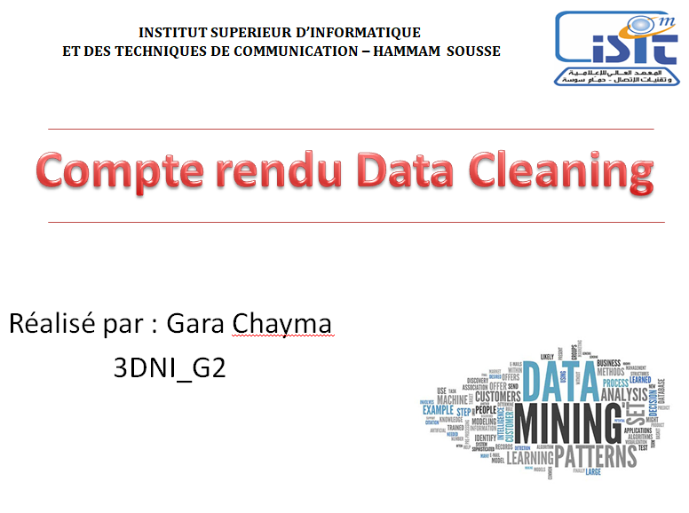

<h3 style ="color : #0492C2 ; font-size: 30px; font-weight:900;  text-align: center;"> Partie Théorique </h3>
<h3 style ="color : #da70d6 ; font-size: 24px; font-weight:900;"> 1) Data Mining </h3>

<u><b>    Le data mining</b></u> désigne le processus d’analyse de volumes massifs de données et du Big Data sous différents angles afin d’identifier des relations entre les data et de les transformer en informations exploitables.
     
           Ce dispositif rentre dans le cadre de la Business Intelligence et a pour but d’aider les entreprises à résoudre des problèmes, à atténuer des risques et à identifier et saisir de nouvelles opportunités business.
         
         Le data mining est un processus indissociable de l’analyse Big Data, de l’intelligence prédictive et de l’exploitation des données.
<h4 style ="color : #cf465a ; font-size: 20px; font-weight:900;"> Concepts clés liés à l’exploration des données </h4>
          
1- Le nettoyage et la préparation de data 

          
2- L’intelligence artificielle (IA)  

          
3- L’apprentissage de règles d’association 

          
4- Le clustering 

          
5- L’analyse de données 

          
6- Le machine learning 

          
7- La régression

<h4 style ="color : #cf465a ; font-size: 20px; font-weight:900;"> Les bénéfices à tirer de la fouille de données </h4>
           
<u><b>Le data mining</b></u> permet aux entreprises de comprendre le passé et le présent en faisant des prédictions précises sur ce qui est susceptibles d’arriver à partir des données afin d’optimiser leur avenir.

 
<b>Ce processus de fouille peut être utilisé pour répondre à de nombreux objectifs business et commerciaux comme :</b>
<ul> <li>Augmenter ses revenus</li>
     <li>Mieux comprendre les segments de clientèle et leurs préférences</li>
     <li>Acquérir de nouveaux clients</li>
     <li>Améliorer le cross-selling et la vente incitative</li>
     <li>Fidéliser les clients et augmenter le taux de rétention (fidélité)</li>
     <li>Augmenter le ROI des campagnes marketing</li>
     <li>Détecter une fraude</li>
     <li>Identifier les risques</li>
     <li>Suivre les performances opérationnelles</li><ul>
  
<h3 style ="color : #da70d6 ; font-size: 24px; font-weight:900;"> 2) Data Cleaning </h3>
    
<B><U>Le nettoyage de données </U></B> est le processus de correction ou de suppression des données incorrectes, corrompues, mal formatées, en double ou incomplètes dans un ensemble de données. Lors de la combinaison de plusieurs sources de données, il existe de nombreuses opportunités pour les données d'être dupliquées ou mal étiquetées. Si les données sont incorrectes, les résultats et les algorithmes ne sont pas fiables, même s'ils peuvent sembler corrects. Il n'existe pas de moyen absolu de prescrire les étapes exactes du processus de nettoyage des données, car les processus varient d'un ensemble de données à l'autre. Mais il est crucial d'établir un modèle pour votre processus de nettoyage des données afin que vous sachiez que vous le faites de la bonne manière à chaque fois.

 <H3>Comment nettoyer les données ?</H3>

Bien que les techniques utilisées pour le nettoyage des données puissent varier en fonction des types de données stockées par votre entreprise, vous pouvez suivre ces étapes de base pour définir un cadre pour votre organisation.

<UL><LI>Étape 1 : Supprimer les observations en double ou non pertinentes</LI>
<LI>Étape 2 : Corrigez les erreurs structurelles</LI>
<LI>Étape 3 : Filtrez les valeurs aberrantes indésirables</LI>
<LI>Étape 4 : Gérer les données manquantes</LI>
    
</UL>
 <h3 style ="color : #0492C2 ; font-size: 30px; font-weight:900;  text-align: center;"> Partie PRATIQUE </h3>
    
